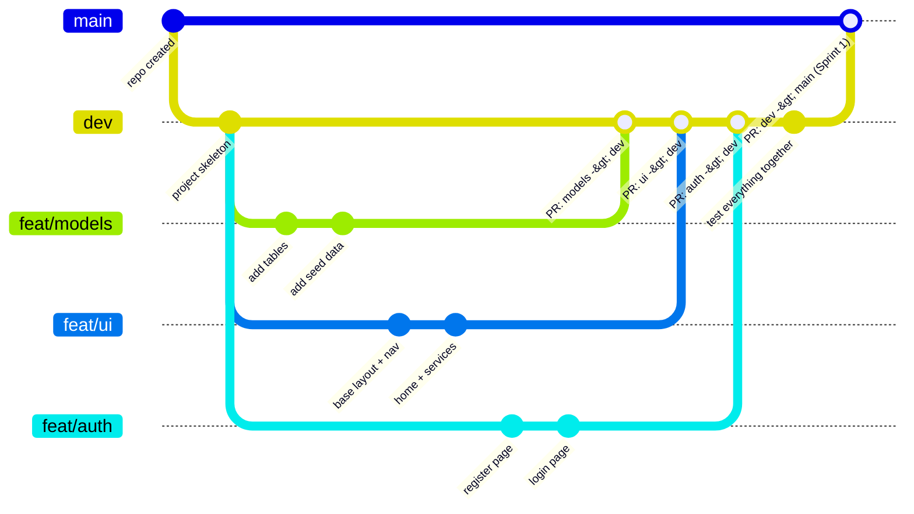

# COSC-3339-Fall-2026-Term-Project
## Project Structure

```
COSC-3339-Fall-2026-Term-Project/
├── manage.py               Django entry point
├── requirements.txt
├── campusdesk/             Project configuration
│   ├── settings.py
│   └── urls.py             Top-level URL routing
├── ops/                    Application logic
│   ├── models.py           Database tables
│   ├── views.py            Request handlers
│   ├── urls.py             App URL routing
│   └── migrations/         Auto-generated schema changes
├── templates/              HTML templates
│   ├── base.html           Shared layout and navigation
│   ├── home.html
│   ├── services.html
│   ├── login.html
│   ├── register.html
│   └── incidents/
├── static/css/             Stylesheets
└── docs/                   ER diagram and documentation
```

## Database Relationships

| Relationship | Type | Implemented via |
|---|---|---|
| User ↔ Team | many-to-many | `TeamMember` join table |
| Team → Service | one-to-many | `Service.owning_team` |
| Service → Incident | one-to-many | `Incident.service` |
| User → Incident (reporter) | one-to-many | `Incident.reported_by` |
| User → Incident (assignee) | one-to-many, optional | `Incident.assigned_to` |
| Team → Incident (assigned team) | one-to-many, optional | `Incident.assigned_team` |
| Incident → IncidentUpdate | one-to-many | `IncidentUpdate.incident` |
| User → IncidentUpdate (author) | one-to-many | `IncidentUpdate.author` |

A user may belong to one or more teams. Each service is owned by exactly one team. Each incident is filed against exactly one service by exactly one reporting user, and may optionally be assigned to a handling user and team. Each incident may accumulate any number of updates, each written by one user.

Full ER diagram: [`docs/ER-DIAGRAM.md`](docs/ER-DIAGRAM.md)

## Branching Strategy



**Reading the diagram:** `main` is at the top and only moves when `dev` is merged into it. `dev` is one level down and collects every finished feature. Each `feat/*` branch starts from `dev`, gets its own commits, and comes back into `dev` through a pull request.

| Branch | Purpose | Receives merges from |
|---|---|---|
| `main` | Stable, deployable code. What runs on the server. | `dev` only |
| `dev` | Integration branch. All features are combined and tested here. | `feat/*` branches via pull request |
| `feat/*` | One branch per feature (e.g. `feat/models`, `feat/auth`, `feat/ui`). | — |

**Workflow**

1. Branch off `dev`: `git checkout dev && git pull && git checkout -b feat/your-feature`
2. Commit to the feature branch as work progresses.
3. When the feature works, open a pull request from `feat/your-feature` into `dev`.
4. Once `dev` is stable, open a pull request from `dev` into `main`.

**Rules**

- No direct commits to `main`. Documentation-only changes (`docs/`, `README.md`) are the one exception.
- Commit frequently with descriptive messages.
- Pull `dev` before starting a new feature branch.
