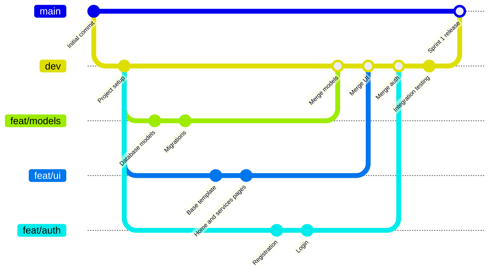

# CampusDesk

CampusDesk is an incident and escalation system for a university campus. Students, faculty, and staff file tickets when something is broken, whether that is a leaking sink, a dead outlet, or Wi-Fi that will not connect. Each ticket is filed against a service, and each service is owned by the team responsible for fixing it. Later sprints add assignment, automatic escalation when tickets go unanswered, and mandatory progress reports from the people handling them.

Live site: https://campusdesk.duckdns.org

Built with Django and PostgreSQL. See [`docs/`](docs/) for the ER diagram and deployment steps.

## Running Locally

```bash
git clone https://github.com/ZiedRbd/COSC-3339-Fall-2026-Term-Project.git
cd COSC-3339-Fall-2026-Term-Project
python -m venv venv
venv\Scripts\activate          # Windows
source venv/bin/activate       # macOS / Linux
pip install -r requirements.txt
python manage.py migrate
python manage.py seed
python manage.py runserver
```

Open http://127.0.0.1:8000. The `seed` command loads three teams, six services, five users, and ten incidents. Sign in with `demo@campusdesk.edu` / `Demo!Pass1`.

Local development uses SQLite. No `.env` file is needed; production settings are read from environment variables only when they are present.

Run the tests with `python manage.py test ops`.

## Project Structure

```
COSC-3339-Fall-2026-Term-Project/
├── manage.py                   Django command entry point
├── requirements.txt            Python dependencies
├── .env.example                Environment variables the server needs
├── campusdesk/                 Project configuration
│   ├── settings.py             Settings, database, static files
│   ├── urls.py                 Top-level URL routing
│   └── wsgi.py                 Entry point for gunicorn
├── ops/                        Application code
│   ├── models.py               Database tables
│   ├── views.py                Request handlers
│   ├── forms.py                Form fields and validation
│   ├── urls.py                 Application URL routing
│   ├── tests.py                Automated tests
│   ├── migrations/             Database schema history
│   └── management/commands/
│       └── seed.py             Loads demo data
├── templates/                  HTML pages
│   ├── base.html               Shared layout and navigation
│   ├── home.html
│   ├── services.html
│   ├── login.html
│   ├── register.html
│   └── incidents/
│       ├── landing.html        Dashboard shown after sign in
│       ├── list.html           Active incidents table
│       └── form.html           Create and edit an incident
├── static/
│   ├── css/style.css           Stylesheet
│   └── js/
│       ├── password.js         Show/hide password and live rule checklist
│       └── incidents.js        Delete confirmation dialog
├── deploy/
│   ├── gunicorn.service        systemd unit for the application server
│   └── nginx.conf              Reverse proxy configuration
└── docs/
    ├── ER-DIAGRAM.md           Entity relationship diagram
    ├── er-diagram.puml         Same diagram in PlantUML
    └── DEPLOYING.md            Steps to release to the server
```

## Database Relationships

| Relationship | Type | Implemented via |
|---|---|---|
| User ↔ Team | many-to-many | `TeamMember` join table |
| Team → Service | one-to-many | `Service.owning_team` |
| Service → Incident | one-to-many | `Incident.service` |
| User → Incident (reporter) | one-to-many | `Incident.reported_by` |
| User → Incident (assignee) | one-to-many, optional | `Incident.assigned_to` |
| Team → Incident (assigned team) | one-to-many, optional | `Incident.assigned_team` |
| Incident → IncidentUpdate | one-to-many | `IncidentUpdate.incident` |
| User → IncidentUpdate (author) | one-to-many | `IncidentUpdate.author` |

A user may belong to one or more teams. Each service is owned by exactly one team. Each incident is filed against exactly one service by exactly one reporting user, and may optionally be assigned to a handling user and team. Each incident may accumulate any number of updates, each written by one user.

Incidents are never physically deleted. Deleting sets `is_deleted` so the ticket leaves the list but its history is kept.

Full ER diagram: [`docs/ER-DIAGRAM.md`](docs/ER-DIAGRAM.md)

## Branching Strategy

The diagram below is an illustrative example of the workflow. Actual branch names and commit order will vary as the project progresses.



**Reading the diagram:** `main` is at the top and only moves when `dev` is merged into it. `dev` is one level down and collects every finished feature. Each `feat/*` branch starts from `dev`, gets its own commits, and comes back into `dev` through a pull request.

| Branch | Purpose | Receives merges from |
|---|---|---|
| `main` | Stable, deployable code. What runs on the server. | `dev` only |
| `dev` | Integration branch. All features are combined and tested here. | `feat/*` and `fix/*` branches via pull request |
| `feat/*`, `fix/*` | One branch per feature or bug fix (e.g. `feat/incident-edit`, `fix/login-redirect`). | — |

**Workflow**

1. Branch off `dev`: `git checkout dev && git pull && git checkout -b feat/your-feature`
2. Commit to the feature branch as work progresses.
3. When the feature works, open a pull request from `feat/your-feature` into `dev`.
4. Once `dev` is stable, open a pull request from `dev` into `main`.

**Rules**

- No direct commits to `main`. Documentation-only changes (`docs/`, `README.md`) are the one exception.
- Commit frequently with descriptive messages.
- Pull `dev` before starting a new feature branch.

## Deployment

The server runs the `main` branch behind nginx and gunicorn with a PostgreSQL database. Steps for pulling a new release onto the server are in [`docs/DEPLOYING.md`](docs/DEPLOYING.md).
