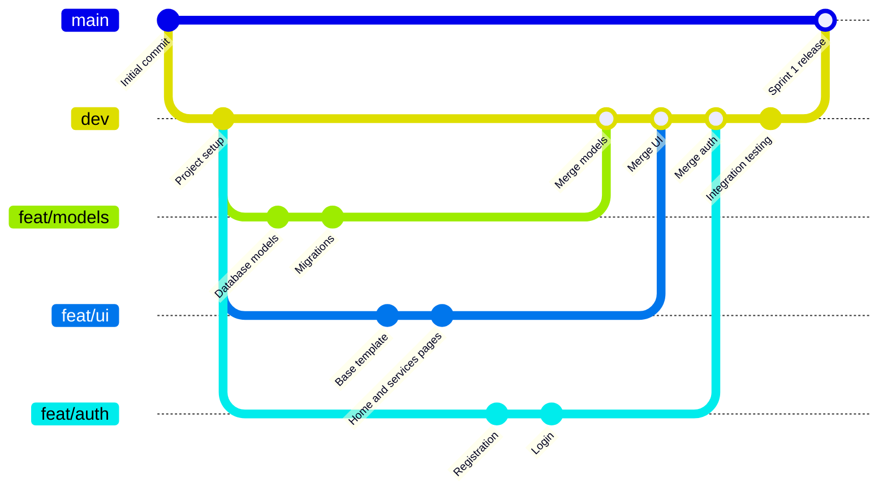

# CampusDesk

CampusDesk is an incident and escalation system for a university campus. Students, faculty, and staff file tickets when something is broken, whether that is a leaking sink, a dead outlet, or Wi-Fi that will not connect. Each ticket is filed against a service, and each service is owned by the team responsible for fixing it. A new ticket is assigned to the solver on call, escalates up the team's own policy when nobody starts work on it, and notifies the people involved in the app and by email.

Live site: https://campusdesk.duckdns.org

Built with Django and PostgreSQL. See [`docs/`](docs/) for the ER diagram and deployment steps.

## Running Locally

```bash
git clone https://github.com/ZiedRbd/COSC-3339-Fall-2026-Term-Project.git
cd COSC-3339-Fall-2026-Term-Project
python -m venv venv
venv\Scripts\activate          # Windows
source venv/bin/activate       # macOS / Linux
pip install -r requirements.txt
python manage.py migrate
python manage.py seed
python manage.py runserver
```

Open http://127.0.0.1:8000. The `seed` command loads three teams, seven services, seventeen users (six reporters, ten solvers and one administrator), and twenty-four incidents. `python manage.py seed_shifts` adds a week of on-call shifts. `python manage.py escalate` runs one pass of the escalation timer by hand.

Local development uses SQLite. No `.env` file is needed; production settings are read from environment variables only when they are present. Without a mail account in the environment, notification emails are printed in the terminal instead of being sent.

Run the tests with `python manage.py test ops`.

## Project Structure

```
COSC-3339-Fall-2026-Term-Project/
├── manage.py                   Django command entry point
├── requirements.txt            Python dependencies
├── .env.example                Environment variables the server needs
├── campusdesk/                 Project configuration
│   ├── settings.py             Settings, database, static files
│   ├── urls.py                 Top-level URL routing
│   ├── asgi.py                 ASGI entry point, not used by the server
│   └── wsgi.py                 Entry point for gunicorn
├── ops/                        Application code
│   ├── models.py               Database tables
│   ├── views.py                Request handlers
│   ├── forms.py                Form fields and validation
│   ├── urls.py                 Application URL routing
│   ├── scheduling.py           Who is on call, schedule validation, assignment, escalation
│   ├── notifications.py        Writes a notification and sends it by email
│   ├── context_processors.py   Unread notifications for the bell on every page
│   ├── timeline.py             Writes entries to a ticket's timeline
│   ├── templatetags/status.py  Shows a status by its label
│   ├── tests/                  Automated tests, one file per purpose
│   ├── apps.py                 Application configuration
│   ├── admin.py                Django admin registration; no models are registered
│   ├── migrations/             Database schema history
│   └── management/commands/
│       ├── seed.py             Loads demo data
│       ├── seed_shifts.py      Seeds 24/7 on-call shifts, for a week or up to a chosen day
│       └── escalate.py         One pass of the escalation timer, run every minute on the server
├── templates/                  HTML pages
│   ├── base.html               Shared layout and navigation
│   ├── home.html
│   ├── services.html
│   ├── login.html
│   ├── register.html
│   ├── profile.html            Profile picture, bio, a reporter's tickets or a solver's teams
│   ├── calendar.html           Weekly on-call calendar
│   ├── schedule.html           A team lead's shift editor
│   ├── shift_table.html        One list of shifts on the schedule page
│   ├── policy.html             A team lead's escalation policy editor
│   └── incidents/
│       ├── landing.html        Links to file a ticket or view the list
│       ├── list.html           A solver's incident table for their teams, with the severity filter
│       ├── form.html           Create and edit an incident
│       └── detail.html         One incident with its timeline
├── static/
│   ├── css/
│   │   ├── base.css            Colours, type, page layout, top bar, and the notification bell
│   │   ├── components.css      Sheets, buttons, forms, notices, tags, tables, and popups
│   │   ├── incidents.css       The ticket, the incident list, the ticket page, schedule and policy
│   │   ├── profile.css         Profile page, profile picture, and a reporter's tickets
│   │   ├── calendar.css        On-call calendar grid
│   │   ├── pages.css           Home, services, log in, register, and the ticket form
│   │   └── animations.css      The few things that move, and the reduced-motion rule
│   ├── js/
│   │   ├── password.js         Show/hide password and live rule checklist
│   │   ├── incidents.js        Delete confirmation dialog
│   │   ├── filter.js           Severity filtering on the incident list
│   │   ├── transition.js       Confirmation modal for status changes
│   │   ├── schedule.js         Shift form popup and confirmation on the schedule page
│   │   └── notifications.js    Opens and closes the bell's list and lays out each notification
│   └── images/
│       ├── favicon.svg         Browser tab icon
│       └── profile_icon.jpeg   Picture shown until a user uploads their own
├── deploy/
│   ├── gunicorn.service        systemd unit for the application server
│   ├── escalate.service        systemd unit that runs one escalation pass
│   ├── escalate.timer          systemd timer that starts it every minute
│   └── nginx.conf              Reverse proxy configuration
└── docs/
    ├── ER-DIAGRAM.md           Entity relationship diagram
    ├── er-diagram.puml         Same diagram in PlantUML
    ├── er-diagram-sprint4.puml   ER diagram of the changes from Sprint 3 to Sprint 4
    ├── incident-state-machine.puml   Incident lifecycle states and transitions
    ├── solver-sequence.puml    How a solver moves an assigned incident forward
    ├── assignment-sequence.puml  How a filed ticket is assigned to the solver on call
    ├── escalation-activity.puml  Activity diagram of the escalation process
    ├── TECHNOLOGY.md           Technology choices and reasoning
    └── DEPLOYING.md            Steps to release to the server
```

## Database Relationships

| Relationship | Type | Implemented via |
|---|---|---|
| User ↔ Team | many-to-many | `TeamMember` join table |
| Team → Service | one-to-many, optional | `Service.owning_team` |
| Service → Incident | one-to-many | `Incident.service` |
| User → Incident (reporter) | one-to-many | `Incident.reported_by` |
| User → Incident (assignee) | one-to-many, optional | `Incident.assigned_to` |
| Team → Incident (assigned team) | one-to-many, optional | `Incident.assigned_team` |
| Incident → IncidentUpdate | one-to-many | `IncidentUpdate.incident` |
| User → IncidentUpdate (author) | one-to-many | `IncidentUpdate.author` |
| User → IncidentUpdate (old and new assignee) | one-to-many, optional | `IncidentUpdate.old_assignee`, `IncidentUpdate.new_assignee` |
| User → Team (lead) | one-to-many, optional | `Team.lead` |
| Team → Shift | one-to-many | `Shift.team` |
| User → Shift (solver) | one-to-many | `Shift.solver` |
| User → Shift (scheduled by) | one-to-many | `Shift.created_by` |
| Team → EscalationTier | one-to-many | `EscalationTier.team` |
| User → EscalationTier (named person) | one-to-many, optional | `EscalationTier.escalate_to_user` |
| User → Notification | one-to-many | `Notification.user` |
| Incident → Notification | one-to-many, optional | `Notification.incident` |

A user may belong to one or more teams. Each service is owned by at most one team; a ticket against a service with no team cannot be assigned. Each incident is filed against exactly one service by exactly one reporting user, and may optionally be assigned to a handling user and team. Each incident may accumulate any number of updates, each written by one user.

Incidents are never physically deleted. Deleting sets `is_deleted` so the ticket leaves the list but its history is kept.

Full ER diagram: [`docs/ER-DIAGRAM.md`](docs/ER-DIAGRAM.md)

## Roles and Incident Lifecycle

**Roles.** Every user is a *reporter* or a *solver* (the `role` field, default `reporter`).
- **Reporters** file tickets and add comments. From their profile page they can edit or delete their own tickets until a solver starts work on one. The service a ticket was filed against is fixed once it is routed. They cannot change a ticket's status.
- **Solvers** work the tickets assigned to their team. They move the tickets assigned to them through the lifecycle and add notes; a team lead can move any ticket of the team. They see the full incident list, filtered to their team, and cannot file or delete tickets. Once work starts on a ticket, only the assigned solver can edit its details.
- **Administrators** are users with `is_superuser` set, a flag on the account and not a third `role` value; the seeded one is a reporter. An administrator is notified when a second ticket, and each one after it, starts waiting in a team's queue, and in the lead's place when a team has no active lead. An administrator can open any ticket to read it, and every action on a ticket is still checked as for any other user. The seeded administrator cannot sign in to the Django admin.

Each role sees a different profile page. Any user can upload a profile picture there (JPEG, PNG or WebP, at most 2 MB); it is stored as a file under `media/avatars/`, outside the repository, and can be replaced or removed. A reporter's profile lists the tickets they filed, split into active and closed. A solver's profile lists the teams they belong to and the members of each team.

A reporter's comments and a solver's notes both appear on the ticket timeline, and neither side can edit the other's entries.

**Severity.** Every ticket is filed with one of four severity levels, required at submission: Low, Medium, High, Critical. The level is shown on the incident list and can be filtered there.

**Lifecycle.** A ticket moves through five states in order, with reopening allowed from the end:

```
Open -> Assigned -> In Progress -> Resolved -> Closed
                                          |            |
                                          +--- reopened back to Open ---+
```

Only legal moves are accepted; an illegal move (skipping a step, or going backward without reopening) is rejected with a message explaining why. The system makes one backward move itself: when a ticket's escalation policy runs out, the ticket returns from Assigned to Open with nobody assigned, and it is not handed out again until the team lead reassigns it. The full diagram is in [`docs/incident-state-machine.puml`](docs/incident-state-machine.puml).

**Timeline.** Each ticket keeps an automatic, non-editable timeline of everything that happens to it: creation, assignment, a failed assignment (why the ticket is waiting), reassignment, escalation, status changes (old to new), severity changes, detail edits (old to new value), comments, and notes. Every entry records a user and the time. An entry the system writes by itself is recorded under the user it concerns: the reporter when the ticket is filed, the solver who receives it from the queue, or the solver who held it when it escalated. The timeline is reached by opening a ticket from the profile or incident list. It is stored in the `IncidentUpdate` table.

## On-Call Scheduling and Assignment

**Team leads.** Each team has a `lead`, a column on the Team table pointing at a user. It is not a role value: a solver may lead any number of teams, finding a team's lead is one row read, and a lead does not have to be a member of the team. Only the lead can edit a team's schedule or reassign its tickets.

**Shifts.** A shift is one solver covering one team between two instants. The interval is half open: a shift covers `starts_at` up to, but not including, `ends_at`, so the end instant belongs to the next shift. Shifts are edited on the team's schedule page, and every change is checked against the whole future schedule before it is saved. A save is refused, with a message naming the day and the window, when it would leave a gap between now and the last shift, double book a team, or put one person on two teams at once. It is also refused when it would put a reporter or a non-member on a shift. A shift that ends before it starts, has already ended, or starts before the hour that is running now is refused by the form. A shift is at most 12 hours, and the same solver cannot take two shifts in a row. Editing a shift's start or end moves the neighbouring shift's boundary with it, so the week stays whole in one save.

**Primary and secondary.** Every shift is primary or secondary, chosen when it is added. The rules above are the primary's: a team has exactly one primary at a time, with no gap between now and its last shift. A secondary is optional, so hours without one are fine. A secondary shift is at most 24 hours, a team has one secondary at a time, a person rests 24 hours between two secondary shifts, and nobody is on call twice at the same moment in any role on any team.

**Calendar.** Solvers see a week of cover for every team they are on or lead, one row per team and one column per day. Leads get a link to the schedule and a link to the escalation policy of each team they lead. Reporters and signed-out visitors cannot open it.

**Automatic assignment.** When a ticket is filed, it goes to the primary on call for the team that owns the service, moving from Open to Assigned with an entry on the timeline. A solver holds at most three unfinished tickets (Assigned or In Progress). Once the primary holds three, new tickets go to the secondary, and once both are full a ticket waits, Open and unassigned, with the reason on its timeline. The team lead is notified about the first ticket waiting and the administrator about the second and every one after it. A waiting ticket is handed out, oldest first, as soon as someone on call has room: the check runs every minute on the server and straight away when a ticket is resolved, closed, deleted or reassigned, a shift is added or edited, another ticket is filed or reopened for the team, a solver opens the incident list, or someone opens a ticket that is waiting. A ticket also waits when its service has no team or nobody is on call. Reopening a ticket releases its solver and assigns it again the same way.

**Reassignment.** A team lead can hand an active ticket to the primary or the secondary on call for the team right now, and to nobody else. A solver who already holds three tickets is refused. The timeline records the time, who did it, and the previous and new solver. Assignment and status changes are recorded with timestamps in the `IncidentUpdate` table.

**Seeding.** `python manage.py seed_shifts` fills every team's schedule from now until a week ahead, around the clock, rotating the team's solvers. Pass `--until 2026-11-30` to cover every team to the end of that day instead. A solver who belongs to two teams is never put on call for both in the same hours. It also adds one secondary shift a day, 08:00 to 16:00, wherever the secondary rules allow one. It replaces current and future shifts only. It never takes a ticket from the solver who holds it, and it hands the tickets that were waiting to whoever on call has room. Pass `--short-team Electrical` to stop one team at midnight tonight so the no-cover case can be shown.

## Escalation and Notifications

**Escalation policy.** Each team has its own policy, edited by its lead on the policy page, reached from the calendar and from the schedule. A policy is a list of tiers, each with a wait in minutes. Tier 1 is always the on-call solver who first receives the ticket, so a policy always has at least one tier. A team that has not written a policy has the default one: the on-call solver has 5 minutes, then the lead has 10. Each later tier names either the team lead, which is a role, or one active solver on the team, which is a user. A wait must be a whole number of minutes from 1 to 1440. After the last tier the policy ends: the ticket is marked unassigned, shown in red at the top of the incident list for every solver on the team, and the lead is notified.

**The timer.** A solver takes responsibility for a ticket by moving it to In Progress. Until then the clock runs from the moment the ticket was assigned, and when the wait of its tier is up the ticket moves to the next tier: the solver changes, the timeline records it, and the new solver is notified. Severity changes every wait: critical tickets wait half as long, high three quarters, medium as written, low twice as long. A tier whose person cannot take the ticket (deactivated, no longer on the team, already holding three tickets, or already the holder) is passed over and named on the timeline. Reopening or reassigning a ticket starts the clock again at tier 1. The check is a scheduled task: a systemd timer runs `python manage.py escalate` once a minute, so it does not depend on anyone having the site open.

**Notifications.** Every notification is a row in the `Notification` table, shown under the bell in the navigation bar, and is also sent by email. A solver is notified when a ticket is assigned to them automatically, reassigned to them by the lead, or escalated to them; the message carries the ticket number, the service, the severity and what to do next. The reporter is notified when work starts on their ticket and when it is resolved, and at no other point. A failed email is logged and never stops the action that caused it; after a failure, email pauses for five minutes so later requests are not slowed down.

## Branching Strategy

The diagram below is an illustrative example of the workflow. Actual branch names and commit order will vary as the project progresses.


```mermaid
%%{init: {'gitGraph': {'mainBranchName': 'main'}}}%%
gitGraph
    commit id: "Initial commit"
    branch dev
    commit id: "Project setup"

    branch feat/models
    commit id: "Database models"
    commit id: "Migrations"

    checkout dev
    branch feat/ui
    commit id: "Base template"
    commit id: "Home and services pages"

    checkout dev
    branch feat/auth
    commit id: "Registration"
    commit id: "Login"

    checkout dev
    merge feat/models id: "Merge models"
    merge feat/ui id: "Merge UI"
    merge feat/auth id: "Merge auth"
    commit id: "Integration testing"

    checkout main
    merge dev id: "Sprint 1 release"
```

**Reading the diagram:** `main` is at the top and only moves when `dev` is merged into it. `dev` is one level down and collects every finished feature. Each `feat/*` branch starts from `dev`, gets its own commits, and comes back into `dev` through a pull request.

| Branch | Purpose | Receives merges from |
|---|---|---|
| `main` | Stable, deployable code. What runs on the server. | `dev` only |
| `dev` | Integration branch. All features are combined and tested here. | `feat/*` and `fix/*` branches via pull request |
| `feat/*`, `fix/*` | One branch per feature or bug fix (e.g. `feat/incident-edit`, `fix/login-redirect`). | — |

**Workflow**

1. Branch off `dev`: `git checkout dev && git pull && git checkout -b feat/your-feature`
2. Commit to the feature branch as work progresses.
3. When the feature works, open a pull request from `feat/your-feature` into `dev`.
4. Once `dev` is stable, open a pull request from `dev` into `main`.

**Rules**

- No direct commits to `main`. Documentation-only changes (`docs/`, `README.md`) are the one exception.
- Commit frequently with descriptive messages.
- Pull `dev` before starting a new feature branch.

## Deployment

The server runs the `main` branch behind nginx and gunicorn with a PostgreSQL database. Steps for pulling a new release onto the server are in [`docs/DEPLOYING.md`](docs/DEPLOYING.md).
