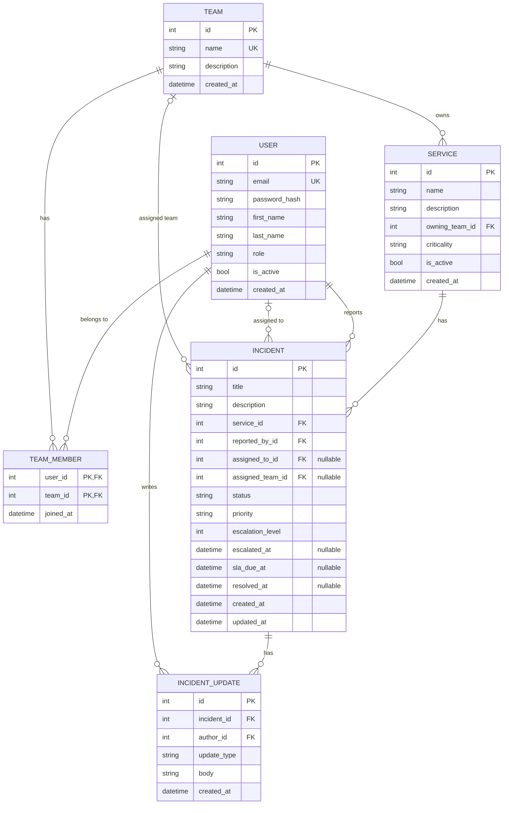

# ER Diagram — Campus IT Help Desk

## Relationships

| Relationship | Type | Via |
|---|---|---|
| User ↔ Team | many-to-many | `TEAM_MEMBER` |
| Team → Service | one-to-many | `SERVICE.owning_team_id` |
| Service → Incident | one-to-many | `INCIDENT.service_id` |
| User → Incident (reporter) | one-to-many | `INCIDENT.reported_by_id` |
| User → Incident (assignee) | one-to-many, optional | `INCIDENT.assigned_to_id` |
| Team → Incident (assigned team) | one-to-many, optional | `INCIDENT.assigned_team_id` |
| Incident → Incident Update | one-to-many | `INCIDENT_UPDATE.incident_id` |
| User → Incident Update (author) | one-to-many | `INCIDENT_UPDATE.author_id` |
